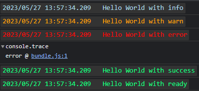
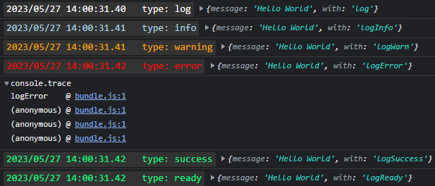
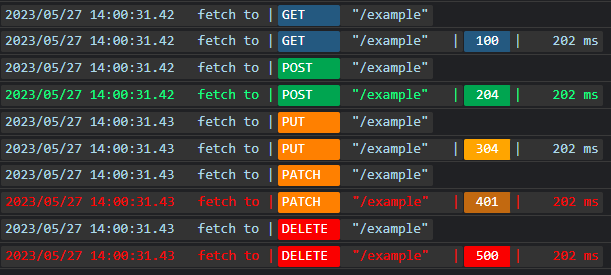

# eye
 Open source log library for TypeScript
 
 To use this library you have to write on the high level this code
 
 `export const eye = new Eye();`

  The "eye" library can be used to decorate the console in the browser.

  Use functions like "info", "ready", "success", "error", "warn" to display text. These functions take 2 parameters: the text itself and whether the time should be displayed (true by default).
  
  For example code
  
  ```typescript
  const eye = new Eye();

  eye.info("Hello World with info")
  eye.warn("Hello World with warn")
  eye.error("Hello World with error")
  eye.success("Hello World with success")
  eye.ready("Hello World with ready")
  ```
  will show

  

  Use functions like "log", "logInfo", "logReady", "logSuccess", "logError", "logWarn" to display objects, arrays, Map or Set. These functions take 2 parameters: the structure itself and whether to output the time (true by default).
  
  For example code
  ```typescript
  const eye = new Eye();
  const obj = {
      message: "Hello World",
      with: ""
  }
  
  eye.log({...obj, with: "log"})
  eye.logInfo({...obj, with: "logInfo"})
  eye.logWarn({...obj, with: "logWarn"})
  eye.logError({...obj, with: "logError"})
  eye.logSuccess({...obj, with: "logSuccess"})
  eye.logReady({...obj, with: "logReady"})
  ```
  will show

  

  The coolest things are the "fetchSend()" and "fetchGet()" functions. Use them to log the request to the server. 
  
  For example code
  ```typescript
  const eye = new Eye();

  const request = {
  	method: "GET",
  	endpoint: "/example",
  	status: 100,
  	time: 202
  }
  
  eye.fetchSend(request.endpoint, request.method)
  eye.fetchGet(request.endpoint, request.method, request.status, request.time)
  
  eye.fetchSend(request.endpoint, "POST")
  eye.fetchGet(request.endpoint, "POST", 204, request.time)
  
  eye.fetchSend(request.endpoint, "PUT")
  eye.fetchGet(request.endpoint, "PUT", 304, request.time)
  
  eye.fetchSend(request.endpoint, "PATCH")
  eye.fetchGet(request.endpoint, "PATCH", 401, request.time)
  
  eye.fetchSend(request.endpoint, "DELETE")
  eye.fetchGet(request.endpoint, "DELETE", 500, request.time)
  ```
  will show

  